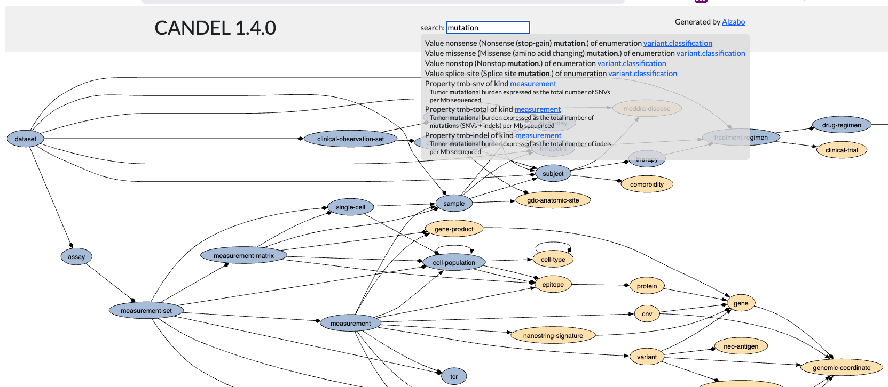

# alzabo

A simple schema management and documentation tool for graph-based systems. [Live example](https://hyperphor.github.io/alzabo/). TODO get this working

Alzabo defines a a simple schema format for graph databases or other storage formats. It's semantically close to RDF.

Core:
- Defines an .edn schema format, with semantics similar to RDF.
- Tool to generate HTML documentation from Alzabo schemas
- A Clojurescript applet to do autocompletion over Alzabo schemas (appears as part of HTML doc)

Import:
- Tool to convert the [CANDEL schema](https://github.com/candelbio/pret/tree/master/resources/schema) into Alzabo schema
- Tool to convert OpenAPI YAML format into Alzabo schemas
- Tool to convert GraphQL format into Alzabo schema

Export:
- Tool to generate Datomic schemas from Alzabo format

## Schema format

Schemas are represented as EDN maps. See [an example](test/resources/schema/rawsugar.edn) or the [schema spec](src/cljc/hyperphor/alzabo/schema.cljc).

`:title` a string
`:version` a string
`:kinds` a map of kind names (keywords) to kind definitions (see below)
`:enums` A map of enum names (keywords) to sequence of enum values (also keywords, generally namespaced)

A kind definition is a map with attributes:
`:fields`: a map of field names (keywords) to field definitions
`:description` a string

A field definition is a map with attributes:
`:type` can be:
 - a keyword, either a kind name, a primitive
 - a vector of types (defines a Datomic heterogenous tuple)
 - a map of the form `{:* <type>}` (defines a Datomic homogenous tuple)
   Default is `:string`
`:doc` a string
`:cardinality` Either `:one` (default) or `:many`
`:unique?` Either `:identity` or `:value`, see [Datomic doc](https://docs.datomic.com/on-prem/schema.html#operational-schema-attributes) for details.
`:unique-id` (deprecated) `true` means the same as `:unique :identity`
 `:attribute` the datomic or sparql attribute corresponding to the field 

The defined primitives are `#{:string :boolean :float :double :long :bigint :bigdec :instant :keyword :uuid}`. 

## Installation

To generate documentation, you need graphviz installed. On the Mac, you can do this with

    $ brew install graphviz

## Usage

### Install as local library

    lein with-profile library, prod install

### Publish on Clojars

From a real terminal (not Emacs)

    lein deploy clojars
	
You will need to supply credentials (user name and authentication token).

## Commands

You can run these commands with `lein run <config> <cmd>`. 

	$ lein run <config> documentation 
	
Generates documentation from the given Alzabo schema file. 

	$ lein run <config? datomic 
	
Generates a Datomic schema from the given Alzabo schema file. 

	$ lein run <config> server

Opens the generated documentation in browser..

## Use as a library

Add dependency `[hyperphor/alzabo <version>]

### Example

    (ns ...
	  (:require [hyperphor.alzabo.schema :as schema]
                [hyperphor.alzabo.datomic :as datomic]
				[hyperphor.alzabo.html :as html]))

	;; read in a schema file
	(let [schema (schema/read-schema <schema.edn>)]

	  ;; write out a Datomic schema
      (datomic/write-schema schema "datomic-schema.edn")
	
      ;; generate documentation 
      (html/schema->html schema "public/schema" {}))

# Schema Generation

TODO refine

    (hyperphor.alzabo.core/full-demo "scientists" "scientists")

# Credits

