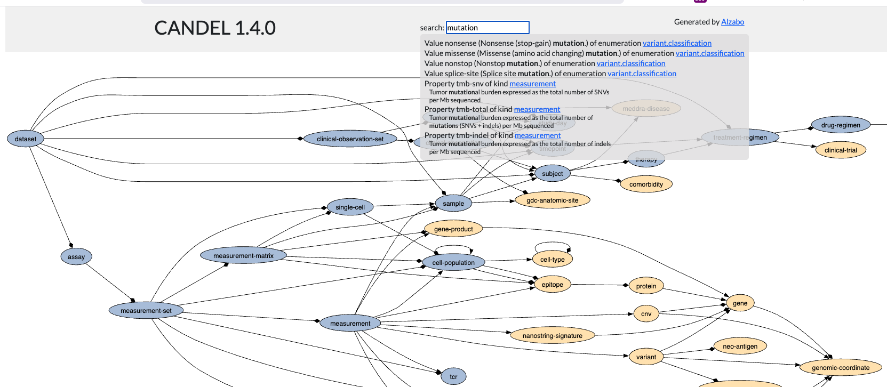

# alzabo

A schema management and documentation tool for graph-shaped knowledge sources. [Example](https://hyperphor.github.io/alzabo/). 

Alzabo defines a a simple schema format for graph databases or other storage formats. It's semantically close to RDF.

Core:
- Defines an .edn schema format, with semantics similar to RDF.
- Tool to generate HTML documentation from Alzabo schemas
- A Clojurescript applet to do autocompletion over Alzabo schemas (appears as part of HTML doc)

Import:
- Tool to convert the [CANDEL schema](https://github.com/candelbio/pret/tree/master/resources/schema) into Alzabo schema
- Tool to convert OpenAPI YAML format into Alzabo schemas
- Tool to convert GraphQL format into Alzabo schema

Export:
- Tool to generate Datomic schemas from Alzabo format

Schema Generation:
 - Tool to generate arbitrary domain schemas 

# Schema format

See [documentation](doc/schema-format.md)

# Credits & License

Originally developed by Mike Travers at the Parker Institute for Cancer Immunotherapy as part of the CANDEL project.

Released under [Apache 2.0 License](https://opensource.org/license/apache-2-0).

# Installation

To generate documentation, you need graphviz installed. On the Mac, you can do this with

    $ brew install graphviz

# Usage

### Install as local library

    lein with-profile library, prod install

### Publish on Clojars

From a real terminal (not Emacs)

    lein deploy clojars
	
You will need to supply credentials (user name and authentication token).

## Commands

You can run these commands with `lein run <config> <cmd>`. 

	$ lein run <config> documentation 
	
Generates documentation from the given Alzabo schema file. 

	$ lein run <config> datomic 
	
Generates a Datomic schema from the given Alzabo schema file. 

	$ lein run <config> server

Opens the generated documentation in browser..

## Use as a library

Add dependency `[hyperphor/alzabo <version>]

### Example

    (ns ...
	  (:require [hyperphor.alzabo.schema :as schema]
                [hyperphor.alzabo.datomic :as datomic]
				[hyperphor.alzabo.html :as html]))

	;; read in a schema file
	(let [schema (schema/read-schema <schema.edn>)]

	  ;; write out a Datomic schema
      (datomic/write-schema schema "datomic-schema.edn")
	
      ;; generate documentation 
      (html/schema->html schema "public/schema" {}))

## Schema Generation

Alzabo can generate a complete domain ontology for you using an LLM.:

    export OPENAI_API_KEY=<your OpenAI key>
    lein repl
    (full-demo "model rocketry" "rockets")  ; or use your favorint doamin

# History
- 1.0.0  Initial open source release, as `org.parkerici/alzabo`
- 1.0.1  Renamed to `org.candelbio/alzabo`; mods for use as a library, OpenAPI import
- 1.1.0  GitHub Pages deployment of generated documentation
- 1.2.1  GraphQL import, config-driven categories/colors, misc CANDEL/Ganymede integration work
- 1.2.2  Replace clj-http with hato; LLM-based schema/entity generation
- 1.3.0  Incorporate into PICI/okc; renamed to `com.hyperphor/alzabo`
- 1.3.1  Turn off schema validation which is broken
- 1.3.2  Use ellum, revamp html gen for easier library use
- 1.3.3  output-path as a param to html gen, deprecate config-based paths
- 1.3.4  Only generate edge labels where there's a need
- 1.3.5  Make edge labels plural-aware, upgrade deps
- 1.3.6  Fix Entities section rendering blank for single-category schemas

